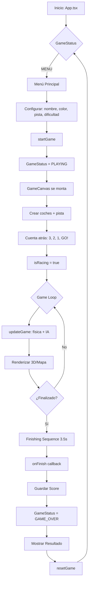
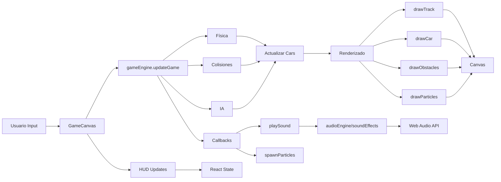

# Arquitectura del Juego - Retro Racer 2.5D

## 📋 Índice

- [Visión General](#visión-general)
- [Estructura de Directorios](#estructura-de-directorios)
- [Componentes Principales](#componentes-principales)
- [Servicios (Services)](#servicios-services)
- [Tipos de Datos (Types)](#tipos-de-datos-types)
- [Flujo del Juego (Game Flow)](#flujo-del-juego-game-flow)
- [Game Loop](#game-loop)
- [Sistema de Renderizado](#sistema-de-renderizado)
- [Sistema de Física](#sistema-de-física)
- [Sistema de Audio](#sistema-de-audio)

---

## Visión General

**Retro Racer 2.5D** es un juego de carreras estilo arcade con gráficos pseudo-3D inspirados en clásicos como OutRun. Está construido con **React**, **TypeScript** y **Canvas API** para el renderizado.

### Características Principales

- ✨ Renderizado pseudo-3D con perspectiva
- 🎮 Física arcade con colisiones y daños
- 🎵 Audio procesal sintetizado (Web Audio API)
- 🏁 Sistema de pistas personalizable
- 👾 IA competitiva con 3 niveles de dificultad
- 💾 Persistencia local de puntuaciones y configuración

### Tecnologías

| Tecnología | Uso |
|------------|-----|
| **React 18** | UI y gestión de estado |
| **TypeScript**  | Tipado estático |
| **Vite** | Bundler y dev server |
| **Canvas API** | Renderizado 2D |
| **Web Audio API** | Síntesis de audio procesal |
| **LocalStorage** | Persistencia de datos |

---

## Estructura de Directorios

```
Retro-Racer/
├── components/
│   └── GameCanvas.tsx          # Componente principal del juego (Canvas + Game Loop)
├── services/
│   ├── audio/
│   │   ├── audioEngine.ts      # Motor de audio (engine sound)
│   │   └── soundEffects.ts     # Efectos de sonido procedurales
│   ├── rendering/
│   │   ├── drawCar.ts          # Renderizado de coches
│   │   ├── drawEnvironment.ts  # Cielo, montañas, césped
│   │   ├── drawObstacles.ts    # Árboles, rocas, barriles, llantas
│   │   ├── drawParticles.ts    # Sistema de partículas
│   │   ├── drawTrack.ts        # Pista 3D con perspectiva
│   │   └── drawUI.ts           # HUD y overlays
│   ├── gameEngine.ts           # Lógica core del juego (física, colisiones, IA)
│   ├── storageService.ts       # Persistencia (scores, settings, tracks)
│   └── trackService.ts         # Gestión y generación de pistas
├── App.tsx                      # Componente raíz (menú, configuración, UI)
├── types.ts                     # Definiciones de tipos TypeScript
├── constants.ts                 # Constantes del juego (física, colores, etc.)
├── index.tsx                    # Entry point
└── index.html                   # HTML principal
```

---

## Componentes Principales

### App.tsx

**Responsabilidad**: Gestión de estados globales, menú principal, configuración y flujo de navegación.

**Estados clave**:
```typescript
- status: GameStatus              // MENU | PLAYING | PAUSED | GAME_OVER
- isPaused: boolean
- settings: PlayerSettings        // Nombre, color, vueltas, dificultad, pista
- scores: Score[]                 // Histórico de puntuaciones
- customTracks: TrackDefinition[] // Pistas personalizadas
```

**Funciones principales**:
- `startGame()` - Inicia una nueva partida
- `pauseGame()` - Pausa/reanuda el juego
- `handleFinish()` - Procesa el final de la carrera y guarda puntuación
- `resetGame()` - Vuelve al menú principal
- `handleSaveTrack()` - Guarda una pista personalizada

**Relación**: Renderiza `<GameCanvas>` cuando `status === PLAYING`.

---

### GameCanvas.tsx

**Responsabilidad**: Loop principal del juego, renderizado del canvas, gestión de input y estado de la carrera.

**Refs clave**:
```typescript
- canvasRef: HTMLCanvasElement    // Canvas para el renderizado
- carsRef: Car[]                  // Coches en la carrera (jugador + IA)
- trackRef: Segment[]             // Segmentos de la pista
- inputRef: {...}                 // Estado de teclas (WASD/Arrows)
- particlesRef: Particle[]        // Partículas visuales
```

**Ciclo de vida**:

1. **Inicialización** (`useEffect` con `status === PLAYING`):
   - Crea coches con `createCars()`
   - Genera pista con `createTrack()`
   - Inicia cuenta atrás (3, 2, 1, GO!)
   - Arranca motor de audio

2. **Game Loop** (requestAnimationFrame):
   - Actualiza física y IA: `updateGame()`
   - Renderiza vista 3D o mapa
   - Actualiza HUD (velocidad, tiempo, daño)
   - Gestiona finalización de carrera

3. **Cleanup**:
   - Detiene motor de audio
   - Cancela animationFrame

**Renderizado**:
- Vista 3D (perspectiva pseudo-3D)
- Vista Mapa (vista aérea 2D)
- Vista Split Screen (jugador vs IA)

---

## Servicios (Services)

### 🎮 gameEngine.ts

**Motor del juego** - Contiene toda la lógica core.

#### Funciones Exportadas

| Función | Descripción |
|---------|-------------|
| `createTrack(trackDef)` | Genera array de `Segment[]` a partir de una definición de pista |
| `createCars(color, name, difficulty, refSpeed)` | Crea array de coches [jugador, IA] con stats según dificultad |
| `updateGame(cars, track, input, dt, laps, callbacks)` | Actualiza física, colisiones, IA cada frame |
| `project(p3D, camera, depth, dimensions)` | Proyecta punto 3D a coordenadas 2D de pantalla |

#### Física Implementada

**Mov. Longitudinal** (aceleración/frenado):
```
- Aceleración: +accel cuando input.up
- Frenado: -BRAKING cuando input.down
- Fricción de aire: -DECEL_COAST automático
- Fricción offroad: cuadrática según distancia del camino
```

**Mov. Lateral** (giro + deriva):
```
- Deriva geométrica: proporcional a curvatura * velocidad
- Fuerza centrífuga: proporcional a curvatura * velocidad²
- Input de dirección: con damping a alta velocidad
```

**Colisiones**:
- **Obstáculos**: Detecta overlap entre coche y sprites de la pista
- **Coches**: Sistema de cajas de colisión (rear/side) con física de empuje

**IA**:
- **Acelera** hacia velocidad objetivo (reducida en curvas cerradas)
- **Esquiva** al jugador si está delante
- **Ajusta velocidad** según curva futura (look-ahead de 20 segmentos)

---

### 🎨 Rendering Services

Módulos especializados en el directorio `services/rendering/`:

#### drawTrack.ts
Renderiza la pista 3D con perspectiva:
- Proyección de segmentos desde Z lejano a Z cercano
- Colores alternados (light/dark) cada 3 segmentos
- Líneas de carril (lane markings)
- Rumble strips (bandas laterales)

#### drawCar.ts
Dibuja coches con detalle:
- Sombra elipsoidal
- Ruedas negras
- Carrocería con color personalizado
- Cabina oscura
- Luces traseras rojas
- Reflejo en capó

#### drawObstacles.ts
Renderiza sprites de obstáculos:
- **Árboles**: Tronco + follaje (3 capas triangulares)
- **Rocas**: Forma irregular con highlight
- **Barriles**: Cilindro rojo con bandas metálicas
- **Llantas**: Círculo negro con interior gris

#### drawParticles.ts
Sistema de partículas para efectos:
- **Humo** (SMOKE): Sube y se expande
- **Fuego** (FIRE): Llamas naranjas
- **Escombros** (DEBRIS): Piezas que caen
- **Chispas** (SPARK): Líneas amarillas
- **Hojas** (LEAF): Verdes que caen
- **Fuegos artificiales** (FIREWORK): Explosión de color

#### drawEnvironment.ts
Elementos de fondo estáticos:
- Cielo degradado
- Montañas procedurales (función seno)
- Césped plano

#### drawUI.ts
HUD y overlays:
- Minimapa (esquina superior izquierda)
- Cuenta atrás (3, 2, 1, GO!)
- Overlay de finalización

---

### 🔊 Audio Services

#### audioEngine.ts

**Motor de audio procesal** - Gestiona el contexto Web Audio y el sonido continuo del motor.

**Arquitectura**:
```
[Oscillator (Sawtooth 60-300Hz)]
         ↓
  [LFO Modulator (15-50Hz)] → Frequency Modulation
         ↓
    [Lowpass Filter]
         ↓
      [Gain Node]
         ↓
    [Master Gain] → Destination
```

**API Exportada**:
- `initAudio(isMuted)` - Inicializa AudioContext y genera buffer de ruido blanco
- `startEngine()` - Crea y arranca osciladores del motor
- `updateEngine(speedRatio)` - Ajusta frecuencia según velocidad (0.0 - 1.0)
- `stopEngine()` - Detiene y limpia osciladores
- `setMuted(muted)` - Activa/desactiva audio con fade suave
- `isEngineRunning()` - Verifica si el motor está sonando

#### soundEffects.ts

**Efectos de sonido procedurales** - Síntesis en tiempo real sin archivos de audio.

**Efectos Disponibles**:

| Tipo | Técnica | Duración |
|------|---------|----------|
| `CRASH` | Sawtooth 100→20Hz | 0.3s |
| `BUMP` | Square 80→40Hz | 0.1s |
| `EXPLOSION` | Ruido blanco filtrado + sub-bass | 1.5s |
| `TIRE` | Sawtooth 80→20Hz con lowpass | 0.25s |
| `BARREL` | Square 150→40Hz con resonancia | 0.4s |
| `REV` | Sawtooth 100→300Hz (rampa UP) | 0.4s |
| `GO` | Square 600→800Hz | 0.8s |
| `VICTORY` | Arpeggio C-E-G-C (triángulo) | 0.6s |
| `DEFEAT` | Notas descendentes C#-C-B-A con vibrato | 1.9s |

---

### 💾 storageService.ts

**Persistencia de datos** usando `localStorage`.

**Claves de almacenamiento**:
```typescript
'retro_racer_scores'        // Score[]
'retro_racer_settings'      // PlayerSettings
'retro_racer_custom_tracks' // TrackDefinition[]
```

**API**:
- `saveScore(score)` / `getScores()` / `clearScores()`
- `saveSettings(settings)` / `getSettings()`
- `saveCustomTrack(track)` / `getCustomTracks()` / `deleteCustomTrack(id)`

**Formato de Score**:
```typescript
{
  name: string,
  avgSpeed: number,  // km/h promedio
  date: string,      // ISO timestamp
  trackName: string  // Nombre de la pista
}
```

---

### 🏁 trackService.ts

**Gestión y generación de pistas**.

**Pistas Predefinidas** (`PRESET_TRACKS`):
1. **"Circuito Clásico"** - Equilibrado, curvas suaves
2. **"Serpentina Loca"** - Muchas curvas cerradas
3. **"Autopista Recta"** - Mayormente rectas
4. **"Montaña Rusa"** - Curvas alternadas L-R extremas
5. **"Desafío Total"** - Mix de todo

**Generación Aleatoria**:
```typescript
generateRandomTrack(
  name: string,
  minSections: number,
  maxSections: number
): TrackDefinition
```

Crea pistas aleatorias con secciones de 20-100 segmentos, curvas de -8 a +8.

**Funciones auxiliares**:
- `getAllTracks()` - Combina presets + custom tracks
- `getTrackById(id)` - Busca por ID

---

## Tipos de Datos (Types)

Definidos en [`types.ts`](file:///Users/franciscomaciaperez/Library/CloudStorage/Dropbox/Desarrollo/Retro-Racer/types.ts).

### Enums

```typescript
enum GameStatus {
  MENU, PLAYING, PAUSED, GAME_OVER
}

enum Difficulty {
  ROOKIE,   // IA lenta (16000 vel. máx)
  AMATEUR,  // IA normal (90% del jugador)
  PRO       // IA rápida (105% del jugador, max 24000)
}
```

### Interfaces Clave

#### Car (Coche)

```typescript
interface Car {
  offset: number;      // Posición lateral (-3 a +3)
  z: number;           // Posición a lo largo de la pista (metros)
  speed: number;       // Velocidad actual
  maxSpeed: number;    // Velocidad máxima
  accel: number;       // Aceleración
  name: string;
  color: string;
  isPlayer: boolean;
  isNpc: boolean;
  lap: number;         // Vuelta actual (1-based)
  lapTime: number;
  finished: boolean;
  damage: number;      // 0-100 (explota a 100)
  exploded: boolean;
}
```

#### Segment (Segmento de Pista)

```typescript
interface Segment {
  index: number;
  p1, p2: Point3D;     // Puntos 3D de inicio/fin
  curve: number;       // Curvatura (-8 a +8)
  mapX, mapY: number;  // Coordenadas 2D para minimapa
  color: {
    road, grass, rumble, lane?: string
  };
  sprites: Sprite[];   // Obstáculos en este segmento
  clip?: number;       // Y de clipping (para Z-order)
  screen?: { x, y, w } // Coordenadas proyectadas 2D
}
```

#### TrackDefinition (Definición de Pista)

```typescript
interface TrackDefinition {
  id: string;
  name: string;
  description: string;
  layout: TrackSection[];  // Array de secciones
}

interface TrackSection {
  type: 'STRAIGHT' | 'CURVE';
  length: number;    // Número de segmentos
  curve?: number;    // Fuerza (-8 a +8)
}
```

---

## Flujo del Juego (Game Flow)



### Estado del Juego

El juego tiene 4 estados principales (`GameStatus`):

1. **MENU**: Pantalla inicial, configuración
2. **PLAYING**: Carrera activa, game loop corriendo
3. **PAUSED**: Juego pausado (se mantiene estado)
4. **GAME_OVER**: Finalización, mostrar resultados

---

## Game Loop

El loop principal está en `GameCanvas.tsx` usando `requestAnimationFrame`:

```typescript
const render = () => {
  // 1. VALIDACIONES
  if (trackRef.current.length === 0) return;
  if (isPaused) {
    stopEngine();
    requestAnimationFrame(render);
    return;
  }
  
  // 2. DELTA TIME
  const now = Date.now();
  const dt = Math.min(1, (now - lastTime) / 1000);
  lastTime = now;
  
  // 3. FÍSICA Y LÓGICA
  updateGame(cars, track, input, dt, totalLaps, {
    onObstacleHit: (type) => playSound(...),
    onCarHit: (type, severity) => playSound(...)
  });
  
  // 4. AUDIO
  if (isEngineRunning() && !finishing) {
    updateEngine(car.speed / car.maxSpeed);
  }
  
  // 5. RENDERIZADO
  clearCanvas();
  
  if (viewMode === 'MAP') {
    renderMapView();
  } else {
    renderView(ctx, cameraCar, viewport);
  }
  
  drawParticles();
  updateParticles();
  
  // 6. HUD
  updateHUD(speed, time, lap, damage);
  
  // 7. CONDICIÓN DE FINALIZACIÓN
  if (anyCarFinished || playerDead) {
    startFinishingSequence();
  }
  
  // 8. CONTINUAR LOOP
  requestAnimationFrame(render);
};
```

**Frecuencia**: ~60 FPS (limitado por el navegador)

---

## Sistema de Renderizado

### Proyección Pseudo-3D

El renderizado 3D se logra mediante proyección en perspectiva:

```typescript
function project(p: Point3D, cameraZ, cameraDepth, width, height, roadWidth) {
  let dist = p.z - cameraZ;
  if (dist < 10) dist = 10;  // Evitar división por 0
  
  let scale = cameraDepth / dist;  // Scale decrece con distancia
  
  let x = (1 + scale * (p.x - cameraX)) * width / 2;
  let y = (1 - scale * (p.y - cameraY)) * height / 2;
  let w = scale * roadWidth * width / 2;
  
  return { x, y, w };  // Coordenadas 2D + ancho
}
```

**Constantes clave** (desde `constants.ts`):
- `CAMERA_DEPTH = 0.84` - Profundidad de campo
- `VISIBILITY = 150` - Segmentos visibles
- `ROAD_WIDTH = 4000` - Ancho de la pista en unidades world

### Orden de Renderizado (Back to Front)

```
1. Cielo (fondo sólido)
2. Montañas (polígono procedural)
3. Césped (rectángulo inferior)
4. Pista (segmentos de lejos a cerca)
   ├─ Carretera
   ├─ Rumble strips
   └─ Líneas de carril
5. Obstáculos (sprites en segmentos)
6. Coches rivales (en sus segmentos)
7. Coche del jugador (siempre al frente, fijo en Y)
8. Partículas (humo, chispas, fuego)
9. HUD y overlays
```

### Vistas Disponibles

| Vista | Descripción | Tecla |
|-------|-------------|-------|
| **Player** | Cámara detrás del jugador | `1` |
| **Rival** | Cámara detrás de la IA | `2` |
| **Split Screen** | Pantalla dividida jugador vs IA | `3` |
| **Map** | Vista aérea 2D de toda la pista | Botón `MAP` |

---

## Sistema de Física

### Constantes de Física (constants.ts)

```typescript
export const PHYSICS = {
  MAX_SPEED: 22000,           // Velocidad máxima del jugador
  ACCEL: 800,                 // Aceleración base
  BRAKING: 1500,              // Frenado activo
  DECEL_COAST: 300,           // Deceleración por fricción de aire
  DECEL_OFFROAD: 1200,        // Fricción offroad (césped)
  STEERING_SPEED: 7.0,        // Velocidad de giro lateral
  DRIFT_FACTOR: 0.75,         // Factor de deriva geométrica
  CENTRIFUGAL_FORCE: 1.5,     // Fuerza centrífuga en curvas
  SPEED_STEERING_DAMPING: 0.6 // Reducción de giro a alta velocidad
};
```

### Daños (DAMAGE)

```typescript
export const DAMAGE = {
  MAX: 100,           // Daño máximo (explota)
  HIT_TREE: 100,      // Árbol = muerte instantánea
  HIT_BOULDER: 100,   // Roca = muerte instantánea
  HIT_BARREL: 15,     // Barril = daño medio
  HIT_TIRE: 8,        // Llanta = daño leve
  HIT_CAR_REAR: 20,   // Chocar por detrás
  HIT_CAR_SIDE: 10    // Roce lateral
};
```

### Detección de Colisiones

**Obstáculos**:
```typescript
// Busca en segmento actual ±2 lookahead
for (let n = 0; n <= 2; n++) {
  const segment = track[(currentSegIdx + n) % trackLen];
  
  for (sprite of segment.sprites) {
    // Overlap en X (offset)
    if (abs(player.offset - sprite.offset) < spriteWidth + 0.15) {
      // Overlap en Z (distancia)
      if (abs(player.z - segmentZ) < SEGMENT_LENGTH) {
        // ¡COLISIÓN!
        applyDamage(sprite.type);
        playSound(sprite.type);
      }
    }
  }
}
```

**Coches** (jugador vs IA):
```typescript
const distZ = player.z - rival.z;
const distX = abs(player.offset - rival.offset);

if (abs(distZ) < CAR_HIT_LENGTH && distX < CAR_HIT_WIDTH) {
  if (abs(distZ) > 250) {
    // REAR HIT: Empujar hacia atrás
    player.speed = rival.speed * 0.75;
    player.z = rival.z - (CAR_HIT_LENGTH + 20);
  } else {
    // SIDE HIT: Deflección lateral
    player.offset += pushDir * 0.3;
    rival.offset -= pushDir * 0.3;
  }
}
```

---

## Sistema de Audio

### Arquitectura de Audio

```
┌─────────────────────┐
│   AudioContext      │  (Singleton global)
│   └─ MasterGain     │  (Control de volumen global)
└─────────────────────┘
         │
         ├──► [Engine Sound] (audioEngine.ts)
         │         │
         │         ├─ Oscillator (Sawtooth) → main tone
         │         ├─ LFO (Square) → modula frequency
         │         └─ Lowpass Filter → suaviza sonido
         │
         └──► [Sound Effects] (soundEffects.ts)
                   │
                   ├─ CRASH, BUMP (Osciladores breves)
                   ├─ EXPLOSION (Ruido blanco + sub-bass)
                   ├─ TIRE, BARREL (Filtrados especiales)
                   ├─ REV, GO (Señales de inicio)
                   └─ VICTORY, DEFEAT (Melodías)
```

### Síntesis Procesal

**Ventajas**:
- ✅ Sin archivos de audio (0 KB de assets)
- ✅ Generación en tiempo real
- ✅ Parámetros dinámicos (frecuencia del motor  según velocidad)
- ✅ Crossfading suave con `setTargetAtTime()`

**Desventajas**:
- ❌ Requiere Web Audio API (navegadores modernos)
- ❌ CPU usage mayor que audio pregrabado
- ❌ Sonidos menos "realistas" que samples

---

## Constantes del Juego

Archivo [`constants.ts`](file:///Users/franciscomaciaperez/Library/CloudStorage/Dropbox/Desarrollo/Retro-Racer/constants.ts) centraliza configuración.

### Dimensiones

```typescript
export const WIDTH = 1920;   // Ancho del canvas
export const HEIGHT = 1080;  // Alto del canvas
export const SEGMENT_LENGTH = 200;  // Longitud de cada segmento
export const ROAD_WIDTH = 4000;     // Ancho de la pista (world units)
```

### Renderizado

```typescript
export const CAMERA_DEPTH = 0.84;  // FOV (mayor = más amplio)
export const VISIBILITY = 150;     // Segmentos a renderizar
```

### Colores

```typescript
export const COLORS = {
  SKY: '#87CEEB',
  MOUNTAIN: '#8B7355',
  LIGHT: {
    road: '#6B6B6B',
    grass: '#10A810',
    rumble: '#F0F0F0',
    lane: '#FFFFFF'
  },
  DARK: {
    road: '#505050',
    grass: '#008000',
    rumble: '#C0C0C0'
  },
  START: { road: '#FFFFFF', ... },  // Línea de salida
  FINISH: { road: '#000000', ... }   // Línea de meta
};
```

### Obstáculos

```typescript
export const OBSTACLES = [
  { type: 'TREE', width: 300, height: 350 },
  { type: 'BOULDER', width: 250, height: 200 },
  { type: 'BARREL', width: 100, height: 120 },
  { type: 'TIRE', width: 80, height: 60 }
];
```

---

## Optimizaciones y Consideraciones

### Performance

**Canvas Rendering**:
- Usa `alpha: false` en getContext para mejor rendimiento
- Limita visibilidad a 150 segmentos (no renderiza toda la pista)
- Clipping de sprites fuera de pantalla

**Game Loop**:
- Delta time clampado a 1 segundo (evita saltos enormes si hay lag)
- RequestAnimationFrame se cancela al salir del juego

**Audio**:
- Un solo AudioContext global (reutilizado)
- Osciladores se destruyen después de usar (`stop()` + `disconnect()`)

### Escalabilidad

**Añadir nuevas pistas**:
1. Crear en `trackService.ts` → `PRESET_TRACKS`
2. O usar `generateRandomTrack()` desde UI

**Añadir nuevos obstáculos**:
1. Definir en `constants.ts` → `OBSTACLES`
2. Implementar dibujo en `services/rendering/drawObstacles.ts`
3. Añadir lógica de daño en `gameEngine.ts`

**Añadir nuevos sonidos**:
1. Añadir tipo en `SoundEffect` type (audioEngine.ts)
2. Implementar síntesis en `soundEffects.ts` → `playSound()`

---

## Diagrama de Flujo de Datos



---

## Resumen de Responsabilidades

| Módulo | Responsabilidad |
|--------|-----------------|
| **App.tsx** | UI, menú, estados globales, configuración |
| **GameCanvas.tsx** | Game loop, input, gestión de carrera |
| **gameEngine.ts** | Física, colisiones, IA, generación de mundo |
| **audioEngine.ts** | Motor de audio continuo |
| **soundEffects.ts** | Efectos de sonido procedurales |
| **rendering/*.ts** | Dibuja cada elemento visual |
| **storageService.ts** | Persistencia localStorage |
| **trackService.ts** | Gestión y generación de pistas |
| **types.ts** | Definiciones TypeScript compartidas |
| **constants.ts** | Configuración central |

---

## Próximos Pasos Recomendados

### Mejoras Potenciales

1. **Multijugador local** (split-screen para 2 jugadores humanos)
2. **Power-ups** (boost de velocidad, escudo anti-daño)
3. **Más pistas** (editor visual de pistas)
4. **Leaderboard online** (backend con API)
5. **Modos de juego** (contrarreloj, eliminación, drift scoring)
6. **Gráficos mejorados** (sprites reales en lugar de formas procedurales)
7. **Efectos climáticos** (lluvia, niebla)

---

*Última actualización: 18/12/2024*
