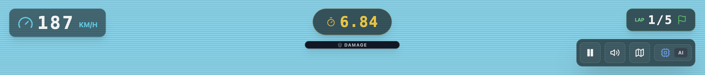
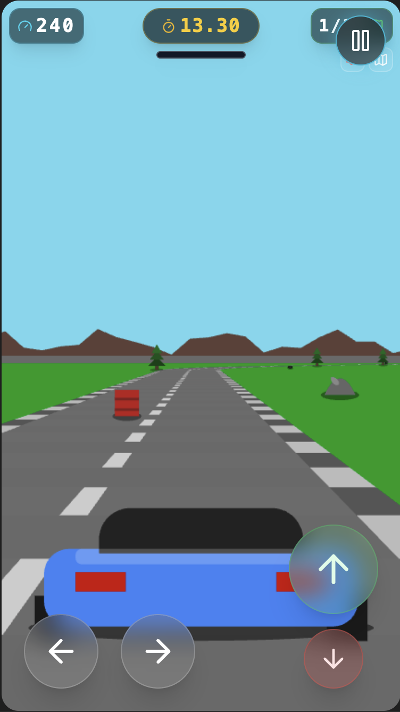
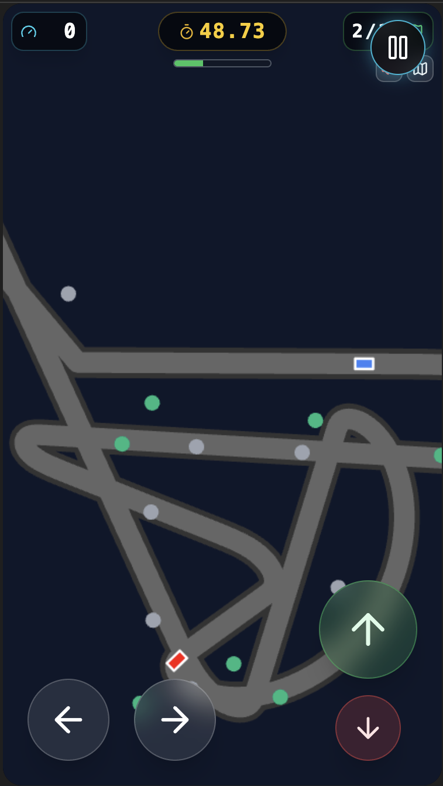

# 🏎️ Retro Racer 2.5D

> Un tributo a los arcades de carreras de los 80 (OutRun, Lotus Turbo Challenge) construido con tecnologías web modernas.


**Retro Racer 2.5D** es un juego de carreras de estilo pseudo-3D construido con **React 19**, **TypeScript** y **HTML5 Canvas**. Cuenta con un motor de física personalizado, generación procedural de pistas, audio sintetizado en tiempo real y una estética Synthwave inmersiva.

Para una visión profunda de cómo está construido el juego, consulta el documento de [Arquitectura Detallada](ARCHITECTURE.md).

---

## ✨ Características Principales

### 🎮 Jugabilidad y Mecánicas
*   **Motor Pseudo-3D (2.5D)**: Utiliza proyección de perspectiva clásica para simular profundidad y velocidad.
*   **Física Avanzada**: Implementación de inercia, fuerza centrífuga, "deriva geométrica" (tangente en curvas) y agarre dinámico según la velocidad.
*   **Sistema de Daños**: Colisiones detalladas. Los coches sufren daños visuales y pueden explotar si se abusa de ellos.
*   **Manchas de Aceite**: Efecto visual acumulativo en el parabrisas que dificulta la visión y se limpia con el tiempo o al terminar la carrera.
*   **IA Competitiva y Segura**: Rivales que trazan curvas, adelantan inteligentemente y evitan obstáculos sin realizar maniobras suicidas.
*   **Obstáculos Destructibles**: Barriles explosivos y neumáticos que reaccionan a los impactos con sistemas de partículas.

### 🛠️ Tecnología
*   **Generación Procedural**: Circuitos infinitos generados aleatoriamente o predefinidos mediante JSON.
*   **Audio Procedural**: ¡Sin archivos MP3! Todo el sonido (motor, derrapes, explosiones) se sintetiza en tiempo real usando la **Web Audio API**.
*   **Gráficos**: Renderizado en Canvas optimizado a 60 FPS con efectos de partículas (humo, fuego, chispas, hojas).
*   **Interfaz Adaptativa**: Controles táctiles para móviles y HUD responsivo.

---

## 🚀 Puesta en Marcha

Sigue estos pasos para ejecutar el juego en tu entorno local.

### Prerrequisitos
*   **Node.js** (v16 o superior)
*   **npm** o **yarn**

### Instalación

1.  **Clonar el repositorio**:
    ```bash
    git clone https://github.com/tu-usuario/Retro-Racer.git
    cd Retro-Racer
    ```

2.  **Instalar dependencias**:
    ```bash
    npm install
    # o
    yarn install
    ```

3.  **Ejecutar el servidor de desarrollo**:
    ```bash
    npm start
    # o
    yarn start
    ```

4.  Abre tu navegador en `http://localhost:5173`.

---

## 🕹️ Instrucciones de Juego

### Objetivo
Compite contra la IA, completa el número de vueltas seleccionado y cruza la meta en primera posición sin destruir tu coche.

### Controles

| Acción | Teclado (PC) | Táctil (Móvil) |
| :--- | :---: | :---: |
| **Girar Izquierda** | `⬅️` o `A` | Botón ⬅️ |
| **Girar Derecha** | `➡️` o `D` | Botón ➡️ |
| **Acelerar** | `⬆️` o `W` | Botón Verde 🟢 |
| **Frenar** | `⬇️` o `S` | Botón Rojo 🔴 |
| **Silenciar Audio** | Clic icono 🔊 | Clic icono 🔊 |
| **Alternar Minimapa** | `O` o Clic 🗺️ | Clic icono 🗺️ |
| **Pausa / Continuar** | `P` o Botón UI | Botón Pausa |
| **Cambiar Cámara** | `1`, `2`, `3`, `4` | - |

### HUD (Interfaz)

*   **KM/H**: Velocidad actual.
*   **TIMER**: Tiempo transcurrido.
*   **BARRA DE DAÑO**: Ubicada bajo el tiempo. Verde = OK, Rojo = Peligro crítico.
    *   En **Pantalla Dividida** (tecla `3`): Se muestran dos barras de daño, una para el jugador (izquierda) y otra para el rival (derecha).
*   **LAP**: Vuelta actual / Total.
*   **MINIMAPA**: Muestra la posición de los corredores y obstáculos en tiempo real.
*   **VISTAS DE CÁMARA** (Teclas `1`-`4` o `Alt` + `1`-`4`):
    *   **Vista Jugador** (tecla `1`): Cámara clásica tras el coche del jugador.
    *   **Vista Rival** (tecla `2`): Cámara de seguimiento para el líder de la IA.
    *   **Pantalla Dividida Vertical** (tecla `3`): Vista lado a lado para Player y CPU.
    *   **Pantalla Dividida Horizontal** (tecla `4`): Vista arriba y abajo.

> [!TIP]
> Todos los atajos (`1`-`4`, `O`, `P`) también funcionan manteniendo pulsada la tecla `Alt`.

---

## 🧠 Detalles Técnicos del Motor

### Física de Conducción
El juego no usa un motor de física 3D real (como Unity o Three.js), sino una simulación matemática sobre un plano 2D proyectado:

1.  **Deriva Geométrica**: Si sueltas el volante en una curva, el coche no sigue la curva. El motor calcula la tangente y desplaza el coche hacia el exterior (`offset`) basándose en la intensidad de la curva.
2.  **Fuerza Centrífuga**: A altas velocidades, se aplica una fuerza exponencial adicional que empuja el coche hacia afuera, obligando a frenar antes de curvas cerradas.
3.  **Fricción Cuadrática**: Al salir de la carretera (zona de césped), la velocidad disminuye cuadráticamente según qué tan lejos estés del asfalto.

### Sistema de Colisiones
*   **Coche vs Coche**:
    *   *Trasera*: El atacante pierde velocidad drásticamente y rebota. Se evita el "tunelado" (atravesar coches) mediante corrección de posición Z.
    *   *Lateral*: Se aplica un vector de fuerza que separa a ambos coches lateralmente.
*   **Coche vs Obstáculo**: Detección anticipada de colisiones (Raycasting simplificado de 3 segmentos) para evitar que objetos delgados (árboles) sean atravesados a alta velocidad.

### Audio Sintetizado
El motor de audio utiliza osciladores (`OscillatorNode`) y ganancia (`GainNode`) para crear sonidos dinámicos:
*   **Motor**: Un oscilador de diente de sierra (`sawtooth`) cuya frecuencia y modulación ("rumble") varían directamente con la velocidad del coche.
*   **Impactos**: Ruido blanco y ondas cuadradas con filtros de paso bajo (`LowPassFilter`) para simular golpes metálicos o secos.

---

## 📂 Estructura del Proyecto
Para más detalles sobre la organización de los archivos y la arquitectura del sistema, consulta [ARCHITECTURE.md](ARCHITECTURE.md).

```
/src
  ├── /components
  │     └── GameCanvas.tsx    # Capa de integración React y bucle principal
  ├── /services
  │     ├── /audio
  │     │     ├── audioEngine.ts    # Sistema de audio Web Audio API
  │     │     └── soundEffects.ts   # Efectos de sonido procedurales
  │     ├── /input
  │     │     └── inputManager.ts   # Gestión de entrada (teclado/táctil)
  │     ├── /rendering
  │     │     ├── drawCar.ts        # Renderizado de coches
  │     │     ├── drawTrack.ts      # Renderizado de pista con perspectiva
  │     │     ├── drawEnvironment.ts # Cielo, césped, montañas
  │     │     ├── drawObstacles.ts  # Sprites (árboles, barriles, etc.)
  │     │     ├── drawParticles.ts  # Sistema de partículas
  │     │     └── drawUI.ts         # Mini-mapa y cuenta atrás
  │     ├── gameEngine.ts     # Lógica física, IA y colisiones
  │     ├── trackService.ts   # Definiciones de circuitos y generador aleatorio
  │     └── storageService.ts # Gestión de LocalStorage para récords
  ├── /types
  │     └── index.ts          # Definiciones de Tipos TypeScript
  ├── App.tsx                 # UI del Menú, Gestión de Estados y Pantalla Final
  ├── constants.ts            # Configuración global (Física, Colores, Sprites)
  └── index.tsx               # Punto de entrada
```

---

## 📸 Galería

| Menú Principal | Carrera (Día) | Mapa 2D |
| :---: | :---: | :---: |
|  |  |  |

---

## 🔮 Futuras Mejoras (Roadmap)
*   [ ] Ciclo Día/Noche dinámico.
*   [ ] Clima (Lluvia que reduce el agarre).
*   [ ] Más tipos de vehículos seleccionables con diferentes estadísticas.
*   [x] ~~Modo Multijugador local (Pantalla dividida)~~ - **¡Implementado!**
*   [ ] Sistema de replays para ver las mejores carreras.
*   [ ] Modo contrareloj con fantasmas.

---

## ✒️ Autores 

_Todos aquellos que ayudaron a levantar el proyecto desde sus inicios:_

* **Paco Maciá** - _Trabajo Inicial_ - [pmacia](https://github.com/pmacia)

<!-- * **Fulanito Detal** - _Documentación_ - [fulanitodetal](#fulanito-de-tal)

También puedes mirar la lista de todos los [contribuyentes](https://github.com/your/project/contributors) quiénes han participado en este proyecto. -->

---

## 📜 Licencia

Este proyecto está bajo la licencia  
**Creative Commons Attribution-NonCommercial 4.0 International (CC BY-NC 4.0)**.

### ✅ Puedes:
- Usar el código y los recursos.
- Modificarlo y crear derivados.
- Compartirlo con otros.

### ❌ No puedes:
- Usarlo con fines comerciales.

### 🔗 Debes:
- Dar crédito al autor original: **Francisco Maciá Pérez**.
- Incluir un enlace a este repositorio cuando lo compartas.


